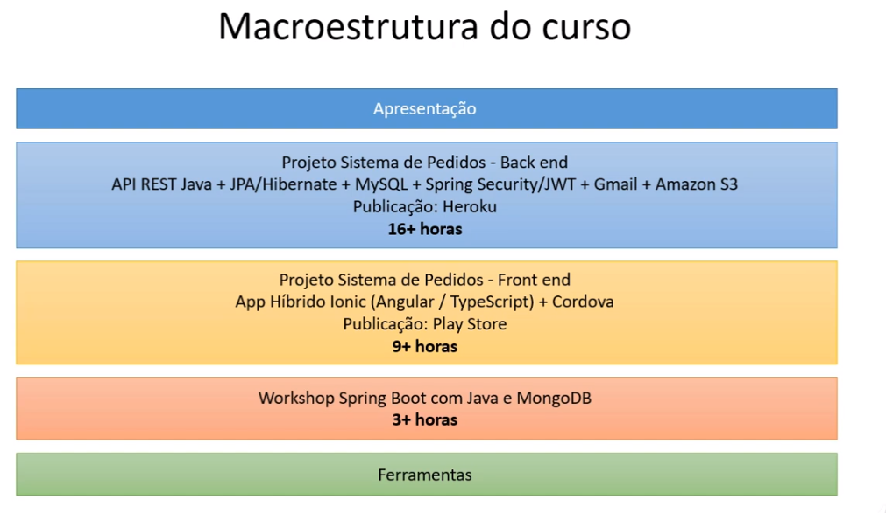
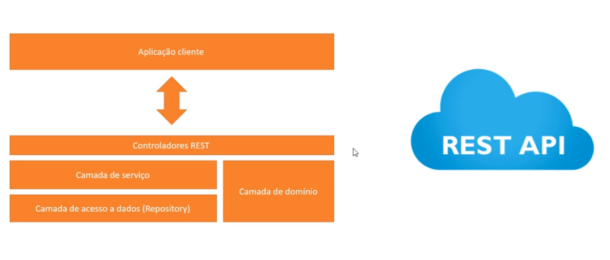
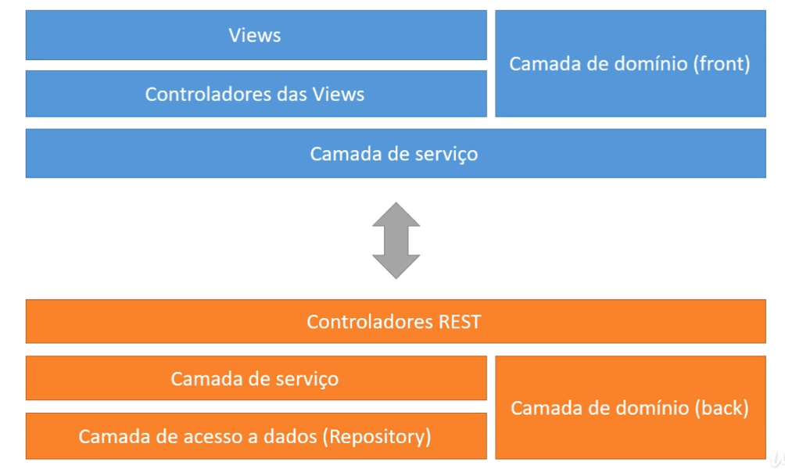
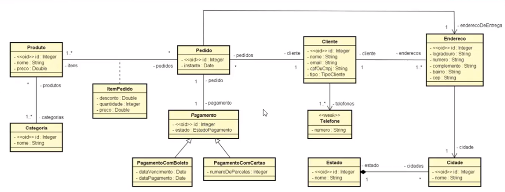
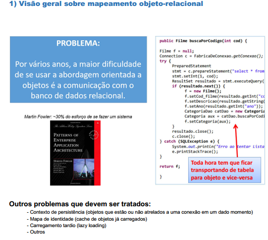
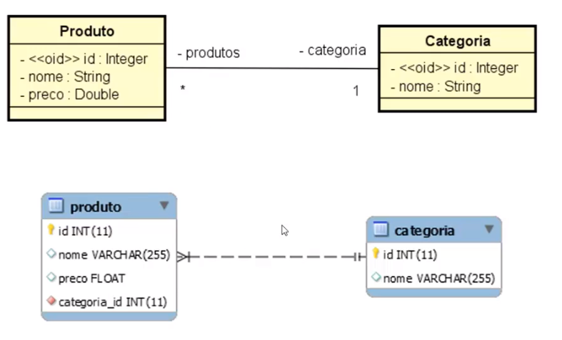

<p><a href="materiais de apoio/02-implementacao-de-modelo-conceitual.pdf" target="_blank">Implementação do Modelo Conceitual</a></p>

-------------------------------------------------------------------------------
<h1>Seção 01 - Introdução</h1>

<h2>Visão geral do curso</h2>



Boas práticas em Engenharia de Software.






-------------------------------------------------------------------------------------
<h1>Seção 02 - Implementação do modelo conceitual</h1>

<h2>Visão geral do estudo de caso do capítulo</h2>

Diagrama de Classes



<h2>Nivelamento JPA</h2>



Configuração do JPA no projeto:
* Crie uma pasta "META-INF" a partir da pasta "src".
* Dentro da pasta META-INF crie um arquivo "persistence.xml".
* Conteúdo do arquivo persistence.xml:

```xml

<?xml version="1.0" encoding="UTF-8"?>
<persistence xmlns="http://xmlns.jcp.org/xml/ns/persistence"
xmlns:xsi="http://www.w3.org/2001/XMLSchema-instance"
xsi:schemaLocation="http://xmlns.jcp.org/xml/ns/persistence
http://xmlns.jcp.org/xml/ns/persistence/persistence_2_1.xsd"
version="2.1">
<persistence-unit name="exemplo-jpa" transaction-type="RESOURCE_LOCAL">
		<properties>
			<property name="javax.persistence.jdbc.driver" value="com.mysql.jdbc.Driver" />
			<property name="javax.persistence.jdbc.url" value="jdbc:mysql://localhost/aulajpa" />
			<property name="javax.persistence.jdbc.user" value="root" />
			<property name="javax.persistence.jdbc.password" value="" />
			<property name="hibernate.hbm2ddl.auto" value="update" />
		</properties>
	</persistence-unit>
</persistence>

```

<h1>Seção 03 - Operações de CRUD e Casos de Uso</h1>

Validações de dados

* Sem acesso a dados
	* Sintáticas
		* Campo não pode ser vazio.
		* Valor numérico mínimo e máximo.
		* Comprimento de string mínimo e máximo.
		* Somente dígitos.
		* Padrão (expressão regular): (##)-####-####
	* Outras
		* Data futura / passada.
	* Mais de um campo
		* Confirmação de senha igual à senha.

* Com acesso a dados
	* Email não pode ser repetido.
	* Cada cliente pode cadastrar no máximo três cupons por mês.

Entidade Categoria:

* Validações sintáticas
	* Nome não pode ser vazio.
	* Nome deve conter entre 5 e 80 caracteres.

<h2>Nivelamento sobre SQL e JPQL</h2>

* JPQL
	* Linguagem de consulta da JPA.
	* Similar à SQL, porém as consultas são expressas em "nível" de objetos.
	* É obrgatória a atribuição de um "alias" (apelido) aos objetos pretendidos na consulta.
		* SELECT * FROM CLIENTE -> retorna um resultset com os dados da tabela CLIENTE
		* SELECT obj FROM Cliente obj -> retorna um List<Cliente>

<h2>Modelo Orientado a Objetos (Diagrama de Classes) x Modelo Relacional</h2>

* Existem certas diferenças entre os dois modelos.



* Consultas Simples
	* Produtos cuja categoria possui id = 1
	* SQL : SELECT * FROM PRODUTO WHERE CATEGORIA_ID = 1;
	* JPQL : SELECT obj FROM Produto obj WHERE obj.categoria.id = 1;

* Junção Simples
	* Produtos cuja categoria possui nome 'Informática'
	* SQL : SELECT PRODUTO.* FROM PRODUTO, CATEGORIA WHERE PRODUTO.CATEGORIA_ID = CATEGORIA.ID AND CATEGORIA.NOME = 'Informática'


